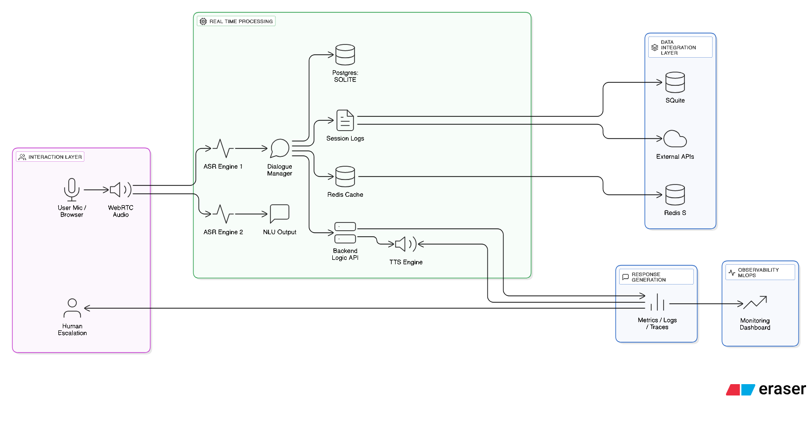

### 🚀 Voice-Activated Cognitive AI Agent

A real-time, voice-driven food ordering system powered by LiveKit Agents, Deepgram ASR, Gemini Flash reasoning, and Murf Falcon TTS.

### Overview

The Voice-Activated Cognitive AI Agent is a production-grade conversational system designed for low-latency, real-time food ordering using WebRTC audio streaming and structured agentic reasoning.

### Key Features

#### 🎙️ Real-Time Voice AI
- WebRTC audio pipeline via LiveKit
- Deepgram Nova-3 for speech-to-text
- Murf Falcon for sub-200ms TTS
- Smart turn detection & noise cancellation

#### 🧠 LLM Commerce Engine
- Gemini Flash interprets user intent
- Structured tool calls for catalog + orders
- Deterministic reasoning for commerce workflows

#### 🛒 Food Ordering Flow
- Catalog browsing
- Intelligent filtering
- Cart operations
- Order creation
- JSON-based order persistence

#### 🖥️ Modern Web Frontend
- Next.js + React
- WebRTC session UI
- Live message transcript
- Clean, responsive interface

### Repository Structure

```
backend/            # Python-based voice agent logic
frontend/           # Next.js WebRTC frontend
architecture.png    # System design diagram
start_app.sh        # Combined startup script
```

### Environment Setup

#### Backend `.env.local`
```shell
LIVEKIT_URL=
LIVEKIT_API_KEY=
LIVEKIT_API_SECRET=

DEEPGRAM_API_KEY=
GOOGLE_API_KEY=
MURF_API_KEY=
```

#### Frontend `.env.local`
```shell
NEXT_PUBLIC_LIVEKIT_URL=
NEXT_PUBLIC_LIVEKIT_API_KEY=
NEXT_PUBLIC_LIVEKIT_API_SECRET=
```

Ensure backend and frontend keys match where required.

### Running the Application

Start all services with:

```shell
./start_app.sh
```

This launches:
- LiveKit server
- Agent backend
- Frontend app at http://localhost:3000

### Technology Stack

#### Core
- Python
- Next.js / React
- LiveKit Agents

#### AI Components
- Deepgram STT
- Gemini Flash LLM
- Murf Falcon TTS

#### Infra & Tools
- WebRTC signaling
- State manager
- JSON-based persistence

### Capabilities

#### 🎧 Voice Interaction
- Natural conversation
- Real-time reasoning
- Interruptible audio
- Context retention

#### 🛒 Commerce Logic
- Product retrieval
- Cart management
- Order creation
- Attribute disambiguation

#### 🧩 Extensible Architecture
- Add custom tools
- Swap TTS/STT models
- Extend catalog schemas

### System Architecture




The high-level system design is illustrated in **architecture.png**, showcasing the flow from audio → ASR → LLM reasoning → tool calls → TTS → audio streaming.

### Future Enhancements
- Multi-vendor ordering
- User profile memory
- Simulated checkout and payments
- Analytics dashboard
- Multi-turn commerce flows

### About the Project

This project demonstrates a full-stack, agentic, voice-driven commerce system built with industry-grade tools and real-time streaming technologies.
It is designed as a robust foundation for next-generation conversational commerce applications.
